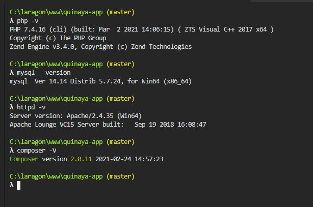
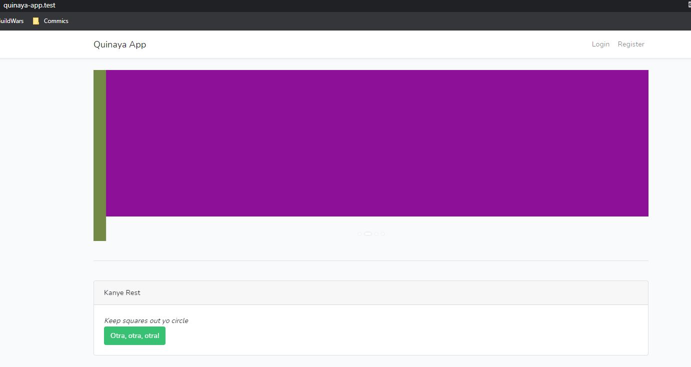
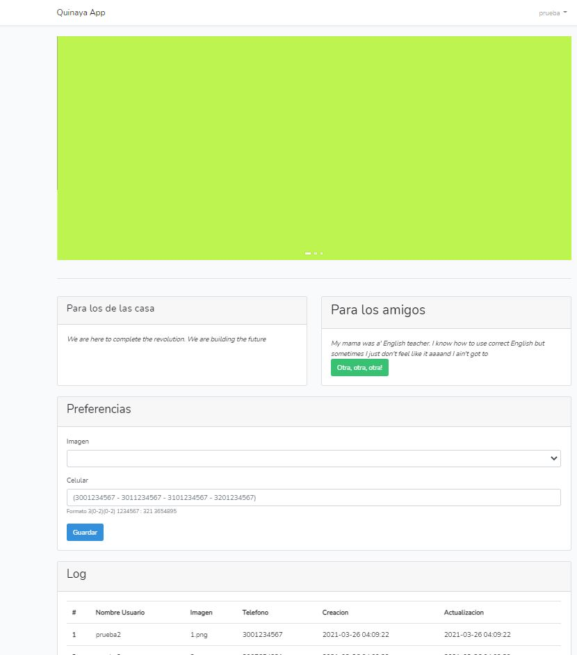

# Quinaya

Test para Quinaya 

## Requerimientos 

* httpd
* php 7.4
* mysql 5.7
* composer 2
* Extensiones basica para correr laravel 8 [requerimientos](https://laravel.com/docs/8.x/deployment#server-requirements)
* docker _opcional_




## Instalacion de paquetes

```shell
composer install
```

```shell
npm install
```

### Ejecutar migraciones 
```shell
php artisan migrate --seed
```
### Hacer rollback de migraciones 
```shell
php artisan migrate:rollback
```

### Ejecutar modo dev

```shell
npm run dev
```
o
```shell
npm run watch
```

### Usuarios por defecto 

Existen dos usuario por defecto 

> Usuarios 

| email | password |
|:------: |:----------:|
|pruebas@pruebas.test|pruebas.test|
|pruebas2@pruebas.test|pruebas.test|

### Capturas de pantalla




### Levantar mysql si no tiene instalado requiere docker previamente instaldo

Se ejecuta a traves del docker-composer

```shell
docker-compose up -d
```

## Consumo Api

Log de preferencias usuario

```shell
http://quinaya-app.test/api/getUser
```
```js
"current_page":1,
"data":[
{
"identificador":3,
"codigoUsuario":"prueba",
"imagen":"1.png",
"celular":"3002122111",
"creado":"2021-03-26 04:10:01",
"actualizado":"2021-03-26 04:10:01"
},
{
"identificador":2,
"codigoUsuario":"prueba2",
"imagen":"3.png",
"celular":"3007654321",
"creado":"2021-03-26 04:09:39",
"actualizado":"2021-03-26 04:09:39"
},
{
"identificador":1,
"codigoUsuario":"prueba2",
"imagen":"1.png",
"celular":"3001234567",
"creado":"2021-03-26 04:09:22",
"actualizado":"2021-03-26 04:09:22"
}
],
"first_page_url":"http:\/\/quinaya-app.test\/api\/getUser?page=1",
"from":1,
"last_page":1,
"last_page_url":"http:\/\/quinaya-app.test\/api\/getUser?page=1",
"links":[
{
"url":null,
"label":"« Previous",
"active":false
},
{
"url":"http:\/\/quinaya-app.test\/api\/getUser?page=1",
"label":"1",
"active":true
},
{
"url":null,
"label":"Next »",
"active":false
}
],
"next_page_url":null,
"path":"http:\/\/quinaya-app.test\/api\/getUser",
"per_page":10,
"prev_page_url":null,
"to":3,
"total":3
```
```shell
 http://quinaya-app.test/api/getUser/paramtroNombre
```

Log citas

```shell
http://quinaya-app.test/api/quotes
```
```js 
{
"current_page":1,
"data":[
{
"cita":"We are here to complete the revolution. We are building the future",
"fecha":"2021-03-26",
"vistas":1
},
{
"cita":"My mama was a' English teacher. I know how to use correct English but sometimes I just don't feel like it aaaand I ain't got to",
"fecha":"2021-03-26",
"vistas":1
},
{
"cita":"Keep squares out yo circle",
"fecha":"2021-03-26",
"vistas":1
},
{
"cita":"I leave my emojis bart Simpson color",
"fecha":"2021-03-26",
"vistas":1
},
{
"cita":"Manga all day",
"fecha":"2021-03-26",
"vistas":1
},
{
"cita":"Shut the fuck up I will fucking laser you with alien fucking eyes and explode your fucking head",
"fecha":"2021-03-26",
"vistas":1
},
{
"cita":"I love sleep; it's my favorite.",
"fecha":"2021-03-26",
"vistas":1
},
{
"cita":"The media tries to kill our heroes one at a time",
"fecha":"2021-03-26",
"vistas":1
},
{
"cita":"We used to diss Michael Jackson the media made us call him crazy ... then they killed him",
"fecha":"2021-03-26",
"vistas":1
},
{
"cita":"We must form a union. We must unify",
"fecha":"2021-03-26",
"vistas":1
}
],
"first_page_url":"http:\/\/quinaya-app.test\/api\/quotes?page=1",
"from":1,
"last_page":2,
"last_page_url":"http:\/\/quinaya-app.test\/api\/quotes?page=2",
"links":[
{
"url":null,
"label":"« Previous",
"active":false
},
{
"url":"http:\/\/quinaya-app.test\/api\/quotes?page=1",
"label":"1",
"active":true
},
{
"url":"http:\/\/quinaya-app.test\/api\/quotes?page=2",
"label":"2",
"active":false
},
{
"url":"http:\/\/quinaya-app.test\/api\/quotes?page=2",
"label":"Next »",
"active":false
}
],
"next_page_url":"http:\/\/quinaya-app.test\/api\/quotes?page=2",
"path":"http:\/\/quinaya-app.test\/api\/quotes",
"per_page":10,
"prev_page_url":null,
"to":10,
"total":15
}
```